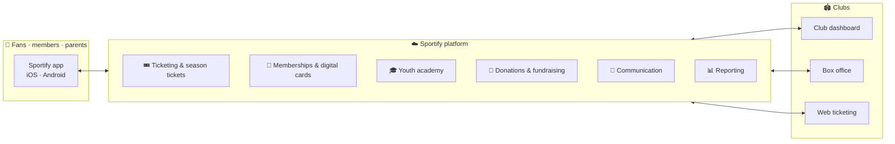

  

<h1 align="center">Sportify</h1>

<strong>Your club in one place.</strong>

  
  
  

  
  
  

 

Sportify is a **free sports club management platform** that connects ticketing, memberships, academy payments, communication and reporting. Clubs run their operations from one web dashboard; fans, members and parents get everything on their phone.

## ⚽ What we build

<table>
  <tr>
    <th align="left">📱 For fans, members and parents</th>
    <th align="left">🏟️ For clubs</th>
  </tr>
  <tr>
    <td valign="top">
      <ul>
        <li>🎟️ Match tickets and season tickets with QR codes and assigned seating</li>
        <li>🪪 Club memberships with renewals and cards for Apple Wallet and Google Wallet</li>
        <li>💚 Donations and fundraising campaigns</li>
        <li>🎓 Youth academy: enrolment, schedules and fee payments</li>
        <li>🔔 Event accreditations, club news and push notifications</li>
      </ul>
    </td>
    <td valign="top">
      <ul>
        <li>🎟️ Ticketing, season tickets and box office with reserved seating</li>
        <li>🪪 Membership management with renewal tracking</li>
        <li>🎓 Academy administration and fee collection</li>
        <li>📣 Communication tools and push campaigns</li>
        <li>📊 Reporting and financial overviews</li>
      </ul>
    </td>
  </tr>
</table>

> [!TIP]
> Fans never queue again: buy in the app, scan at the gate, keep the season ticket and membership card in your wallet.

## 🤝 Who runs on Sportify

  <strong>HNK Rijeka</strong> &nbsp;·&nbsp; <strong>NK Varaždin</strong> &nbsp;·&nbsp; <strong>HNK Gorica</strong> &nbsp;·&nbsp; <strong>NK Rudeš</strong> &nbsp;·&nbsp; <strong>NK Croatia Zmijavci</strong> &nbsp;·&nbsp; <strong>NK Karlovac 1919</strong>

… and more clubs across Croatia.

## 🚀 A match day with Sportify

1. **Tickets go on sale** in the app and on the club's web shop; members get their priority window first.
2. **Fans buy in seconds**: reserved seat or general admission, card, Apple Pay or Google Pay.
3. **At the gate**, the QR code is scanned; season tickets and memberships live in the phone's wallet.
4. **The club sees everything** in one dashboard: sales, attendance, members, academy fees, donations.

🛠️ <strong>Under the hood</strong>

 

| Layer | Stack |
| --- | --- |
| Mobile app | React Native · Expo · TypeScript |
| Club dashboard, box office, web ticketing | Angular · TypeScript |
| Backend | Java · Spring · AWS |
| Payments | Revolut (card, Apple Pay, Google Pay) |

> [!NOTE]
> Our product code lives in private repositories. For partnerships, integrations or club onboarding, write to [contact@sportify-app.com](mailto:contact@sportify-app.com).

 

  Made with ❤️ in Zagreb by <strong>Unidos Grupa d.o.o.</strong>

